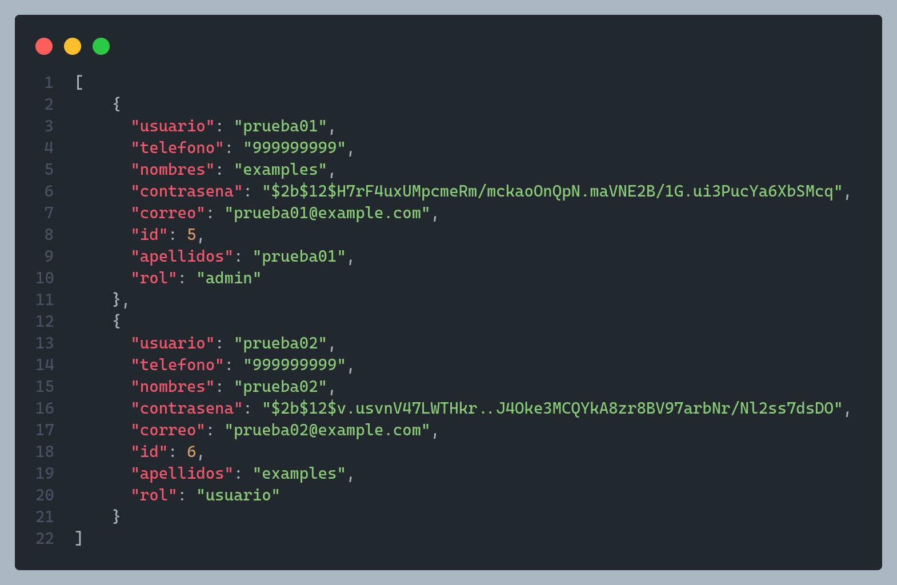
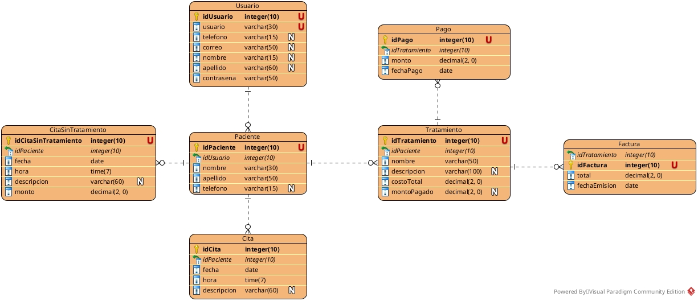

# **Sistema de Reservas y Control de Tratamientos de Citas API**  

  
Este es un proyecto de API desarrollado en Python utilizando el framework FastAPI y PostgreSQL como gestor de base de datos.   
El objetivo de esta API es proporcionar un sistema robusto para la gestión de reservas y el control de tratamientos de citas  
en clínicas médicas u otros entornos similares.  
  
## **Autor**  
- **Nombre:** Cristian Monzon Guzman  
- **Correo:** cristian-02-@live.com
- **LinkedIn:** [¡Conéctame en LinkedIn!](https://www.linkedin.com/in/cristian-monzon-guzman/)
  
## Caracteristicas Principales  
- Gestión de citas y reservas de pacientes.  
- Seguimiento de tratamientos médicos.  
- Administración de personal médico y de apoyo.  
- Almacenamiento seguro de datos de pacientes y médicos en una base de datos PostgreSQL.  
  
## **Capturas de Pantalla**  
A continuación, se presenta algunas capturas de pantalla que muestra cómo funciona la API en acción:  
  


  
## **Diagrama de la Base de Datos**  

  
## Instalación  
A continuación, se detallan los pasos para configurar y ejecutar el proyecto en tu entorno local.  
  
1. Clona este repositorio en tu maquina local: <br>
```bash
git clone https://github.com/monchi789/crud_dentist.git
```

2. Crea un entorno virtual (recomendado) e instala las dependencias: 
```bash
python -m venv venv
source venv/bin/activate   # En Windows: venv\Scripts\activate
pip install -r requirements.txt
```

3.  Configura las variables de entorno necesarias, como las credenciales de la base de datos PostgreSQL.
4. Inicia la aplicación:
```bash
uvicorn main:app --reload
```

5. Accede a la API en `http://localhost:8000/docs` en tu navegador o herramienta de cliente API.

## Uso
A continuación, se detallan algunos ejemplos de cómo utilizar la API:
- **Endpoint de Users:** Para crear un usuario, realiza una solicitud POST a `/users` con los datos del usuario
```json
[
    {
        "usuario": "monchi789",
        "telefono": "999999999",
        "nombres": "Cristian",
        "contrasena": "$2b$12$C5mVxiIyVelL6IQxXJIOgulQ4.L9eRi5q90fGLRB4ed0HW00QzGwK",
        "correo": "monchi789@example.com",
        "id": 4,
        "apellidos": "Monzon Guzman",
        "rol": "admin"
    }
    
]
```
- **Endpoint de Consulta de Pacientes**: Para obtener información de un usuario, realiza una solicitud GET a `/users/{id}` donde `{id}` es el ID del usuario.
